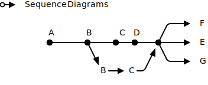
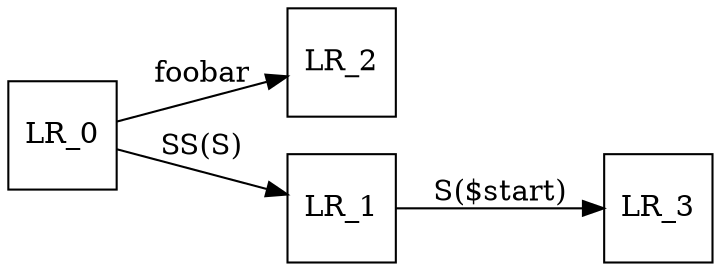
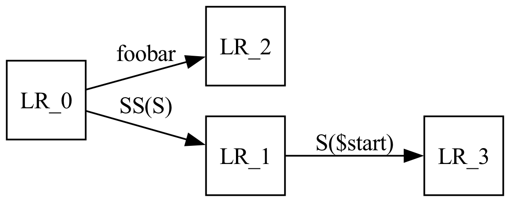
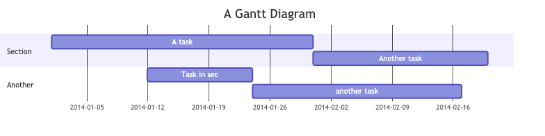

```
  ___  _       __  __         ____             _ 
 / _ \| |__   |  \/  |_   _  |  _ \  ___   ___| |
| | | | '_ \  | |\/| | | | | | | | |/ _ \ / __| |
| |_| | | | | | |  | | |_| | | |_| | (_) | (__|_|
 \___/|_| |_| |_|  |_|\__, | |____/ \___/ \___(_)
                      |___/                      
```

# Oh My Doc!

"Oh My Doc" –– or, short, `omd`, is a preprocessor which lets an author write markdown containing code snippets. When generating markdown `omd` executes these code snippets and puts the results into the generated output in a markdown-compatible way. This lets authors combine written content and dynamically generated data *omd's* input still looks like and very much is markdown.

For example, the logo above is generated via the figlet(1) command. This is achieved by the following input section:

    ```{@bash}
    if ! which figlet > /dev/null ; then
      echo "Please install figlet via 'brew install figlet'" >&2
      exit 1
    fi
    
    figlet "Oh My Doc!"
    ```

Currently *omd* is able to handle the following types of code output:

- plaintext
- CSV tables
- jpg- and png-images

Currently *omd* supports the following types of code:

- Shell commands
- C language programs: they are compiled and executed, and their output is embedded verbatim in the output;
- Ruby programs: they are executed, and their output is embedded verbatim in the output;
- Graphviz dot scripts: they are rendered into images that then are embedded into the output;
- svgbob diagrams: they are executed via svgbob (TODO: add link) and embedded as a SVG image.
- SQL commands: they are executed via a sqlite session, and, by default, the output is rendered into a table;
- psql commands: they are executed the psql CLI, and, by default, the output is rendered into a table;

## SECURITY ANNOUNCEMENT

Since the embedded scripts's functionality is by intention not crippled, a document, when run through *omd*, could be harmful. **You should therefore never open a OMD file that you didn't write yourself or inspected properly.**

You have been warned.

## Installation & usage

1. Have a recent ruby version (we are currently using ruby 2.7.2)
2. Make sure bundler is installed: `gem install bundler`
3. Copy the script `bin/omd` into a location in your path.

*omd* uses a inline bunder setup; the first time you run it it will fetch some dependencies from rubygems.

<!--BREAK-->

## Command line usage

To process an input file run

    omd process [ --clean ] [ --display ] <src> [ --output=<dest> ]

To continuously watch the input file for changes and rebuild when necessary run

    omd watch [ --clean ] [ --display ] <src> [ --output=<dest> ]

Command line flags are:

- **`--clean`** *omd* manages a cache of command executions. The `--clean` command line argument makes sure to purge the cache, effectively rebuilding the entire document.
- **`--display`** start the *Marked 2* OSX application to display the generated result. *Marked 2* watches input document for changes, automatically refreshing whenever necessary.

<!--BREAK-->

# *omd* input files

In general, *omd* only deals with code blocks like the following, leaving everything else alone:

    ```{cc}
    #include <stdio.h>

    int main() {
      printf("Hello omd!\n"); return 0;
    }
    ```


The characters between `{` and `}` in the opening fence describe ***omd* processing instructions**. They define the expected syntax in the code block. If a code block's processing instruction is supported by *omd* the embedded program is build and run, and its output is captured and embedded into the resulting markdown file.

## Controlling the display of the code block

When `omd` detects a code block it copies the code block into the output, followed by the code's output. It is possible to suppress either the entire source code block, leaving only the result in the output, by prepending the codeblock marker with a `@` character:

    ```{@cc}
    #include <stdio.h>
    
    int main() {
      printf("You should not see my source!\n"); return 0;
    }
    ```

resulting in

```
You should not see my source!
```

Alternatively, to hide some, but not all of the input, prepend these lines with an `@` character:

    ```{cc}
    @#include <stdio.h>
    
    int main() {
      printf("The #include line should not be seen here.\n"); return 0;
    }
    ```

resulting in

```cc
int main() {
  printf("The #include line should not be seen here.\n"); return 0;
}
```
```
The #include line should not be seen here.
```


## Comments

A comment block is not rendered in the output.

    ```{comment}
    This document is intended for processing with OMD  
    https://github.com/radiospiel/omd
    ```

## C: the `{cc}` processing instruction

The following block is compiling a C program and rendering both the source code and the output of the command. Lines starting with `@` are omitted from the output:

    ```{cc}
        @ #include <stdio.h>
        @ #include <stdlib.h>
        
        int fib(int n) {
          return n < 3 ? 1 : fib(n-1) + fib(n-2);
        }
    
        int main() {
          int n = 10;
          printf("Fibonacci number of %d is %d\n", n, fib(n));
        }
    ```

The result looks like this:

```cc
int fib(int n) {
  return n < 3 ? 1 : fib(n-1) + fib(n-2);
}

int main() {
  int n = 10;
  printf("Fibonacci number of %d is %d\n", n, fib(n));
}
```
```
Fibonacci number of 10 is 55
```

## svgbob: the `{bob}` processing instruction

The following block is being run through svgbob. The graph is then embedded as an SVG image:

    ```{bob}
    o->  Sequence Diagrams
    
                                       .--->  F
              A       B      C  D     /
              *-------*-----*---*----*----->  E
                       \            ^ \
                        v          /   '--->  G
                         B --> C -'
    ```

The result looks like this:




## Graphviz: the `{dot}` processing instruction

The following block is being run through Graphviz`s `dot` command to generate a graph. The graph is then embedded as an image:

    ```{dot}
    digraph finite_state_machine {
	    rankdir=LR;
	    node [shape = square];
	    LR_0 -> LR_2 [ label = "foobar" ];
	    LR_0 -> LR_1 [ label = "SS(S)" ];
	    LR_1 -> LR_3 [ label = "S($start)" ];
    }
    ```

The result looks like this:




## mermaid: the `{mermaid}` processing instruction

The following block is being run through mermaidjs' command line to generate an image.

    ```{mermaid}
    gantt
        title A Gantt Diagram
        dateFormat  YYYY-MM-DD
        section Section
        A task           :a1, 2014-01-01, 30d
        Another task     :after a1  , 20d
        section Another
        Task in sec      :2014-01-12  , 12d
        another task      : 24d
    ```



## Shell code: the `{bash}` processing instruction

The following block is running a shell script:

    ```{bash}
		fortune all
    ```

The result looks like this:

```bash
fortune all
```
```
YOU PICKED KARL MALDEN'S NOSE!!
```

## SQL: the `{sql}` processing instruction

The following block is being executed as a SQL command:

    ```{sql}
    SELECT
      value,
      value * value AS square
      FROM (
        SELECT value FROM generate_series(1, 6)
      ) subquery
    ```

The result looks like this:

```sql
SELECT
  value,
  value * value AS square
  FROM (
    SELECT value FROM generate_series(1, 6)
  ) subquery
```
|value | square|
|------|-------|
|1 | 1|
|2 | 4|
|3 | 9|
|4 | 16|
|5 | 25|
|6 | 36|

<small>6 rows, runtime: 0.02 secs</small>

The SQL code is executed in a sqlite3 in-memory database.


## PostgresQL: the `{psql}` processing instruction

The following block is being executed as a SQL command:

    ```{psql}
    SELECT
      value,
      value * value * value AS cubed
      FROM (
        SELECT value FROM generate_series(-2, 3) value
      ) subquery
    ```

The result looks like this:

```psql
SELECT
  value,
  value * value * value AS cubed
  FROM (
    SELECT value FROM generate_series(-2, 3) value
  ) subquery
```
|value | cubed|
|------|------|
|-2 | -8|
|-1 | -1|
|0 | 0|
|1 | 1|
|2 | 8|
|3 | 27|

<small>6 rows, runtime: 0.02 secs</small>

The SQL code is executed in your default postgresql database.

## Controlling the display mode

The above examples use some default display mode to print the result. `omd` also allows you to override this. The following example runs git diff on a file in this repository, formatting the output in diff mode:

    ```{bash | diff}
    git diff cb6e2b0a~ cb6e2b0a
    ```

The result looks like this:

```diff
diff --git a/bin/omd b/bin/omd
index f5046a4..8f1ba96 100755
--- a/bin/omd
+++ b/bin/omd
@@ -128,6 +128,4 @@ module OMD::CLI
     end
 
-    logger.info "#{dirs.inspect} #{src_dir.inspect}"
-
     src_dir = File.expand_path(src_dir)
     if dirs.any? { |dir| dir.start_with?(src_dir) }
@@ -478,6 +476,4 @@ module OMD
     lang = $1 if intro =~ /^@?(\S+)/
 
-    logger.warn "lang", lang
-
     if !lang || !Processors.respond_to?(lang)
       writer.error "omd: Unsupported omd processor #{intro.inspect}"
@@ -486,5 +482,5 @@ module OMD
 
     writer.transaction lang, code_block do
-      logger.warn "intro", intro
+      logger.warn "processing an #{intro.inspect} block"
 
       Dir.mktmpdir do |tmpdir|
```
