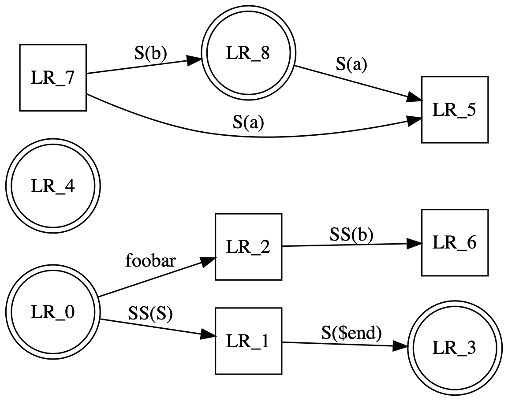

# Oh My Doc!

"Oh My Doc" –– or, short, `omd`, helps you write about code. It lets you embed both code blocks and their results into a Markdown document. This, I hope, should help people writing about and discussing code.

The input to *omd* still looks like and very much is markdown. In contrast to general markdown processing *omd* lets you embed both input data usually not processable by markdown.

*omd* acts as a preprocessor, converting enriched markdown into plain markdown, while taking care to process such input into a format that is generally compatibe with Markdown renderers, and embeds the generated output into the created target file.

Currently *omd* supports the following input:

- C language programs: they are compiled and executed; their output is embedded verbatim in the output;
- Graphviz dot scripts: they are rendered into images that then are embedded into the output;
- SQL commands: they are executed via a psql session; the output is rendered into a table.

With all of the above the input data can either be included in the rendered Markdown, or hidden.

## Security warning

Since the embedded scripts's functionality is by intention not crippled, a document, when run through *omd*, could be harmful. **You should therefore never open a OMD file that you didn't write yourself or inspected properly.**

You have been warned.

# General use

In general, *omd* only deals with code blocks like the following, leaving everything else alone:

    ```{cc}
    #include <stdio.h>

    int main() {
      printf("Hello omd!\n"); return 0;
    }
    ```

The characters between `{` and `}` in the opening fence describe ** *omd* processing instructions**. Generallythey denote a programming language. If supported by *omd* the embedded program is build and run, and it's output is captured and embedded into the resulting markdown file.

## Command line usage

    omd process [ --clean ] [ --no-display ] <src> <dest>
    omd watch [ --clean ] [ --no-display ] <src> <dest>

## omd processing instructions

### Comments

A comment block is not rendered in the output.

    ```{comment}
    This document is intended for processing with OMD  
    https://github.com/radiospiel/omd
    ```

### Processing a OMD document

OMD documents generally contain program code, which is executed in order to generate a Markdown file, which can then be viewed passively.

Since the embedded scripts are intentionally not crippled, it is very easy to set up a document that could, for example, delete your hard disk. **You should therefore never open a OMD file that you didn't write yourself or inspected properly.**

### C

The following block is compiling a C program and rendering both the source code and the output of the command. Lines starting with `@` are omitted from the output:

    ```{cc}
        @ #include <stdio.h>
        @ #include <stdlib.h>
        
        int fib(int n) {
          return n < 3 ? 1 : fib(n-1) + fib(n-2);
        }
    
        int main(int argc, char** argv) {
          int n = atoi(argv[1]);
          printf("Fibonacci number of %d is %d\n", n, fib(n));
        }
    ```

The result looks like this:

```cc
int fib(int n) {
  return n < 3 ? 1 : fib(n-1) + fib(n-2);
}

int main(int argc, char** argv) {
  int n = atoi(argv[1]);
  printf("Fibonacci number of %d is %d\n", n, fib(n));
}
```
```
Fibonacci number of 10 is 55
```

## Hiding parts or all of the source code

Lines in the source code portion starting with `@` are not included in the rendered markdown file.

Note that it is also possible to completely omit the command source code by prefixing the OMD processing instruction with an `@`, which works with all embedded commands.

    ```{@cc}
        #include <stdio.h>
        #include <stdlib.h>
        
        int fib(int n) {
          return n < 3 ? 1 : fib(n-1) + fib(n-2);
        }
    
        int main(int argc, char** argv) {
          int n = atoi(argv[1]);
          printf("Fibonacci number of %d is %d\n", n, fib(n));
        }
    ```

## Simple Code


The following is a simple command:


This code is pretty straight forward - but what does it communicate?


```sql
SELECT *
FROM
  generate_series(1, 3) as a(n),
  generate_series(1, 3)
```
|n | generate_series|
|--|----------------|
|1 | 1|
|1 | 2|
|1 | 3|
|2 | 1|
|2 | 2|
|2 | 3|
|3 | 1|
|3 | 2|
|3 | 3|
|(9 rows)|




```
Marked 2 has trouble with fenced code blocks with intendation.
This document is rendered incorrectly in Marked 2.
```
