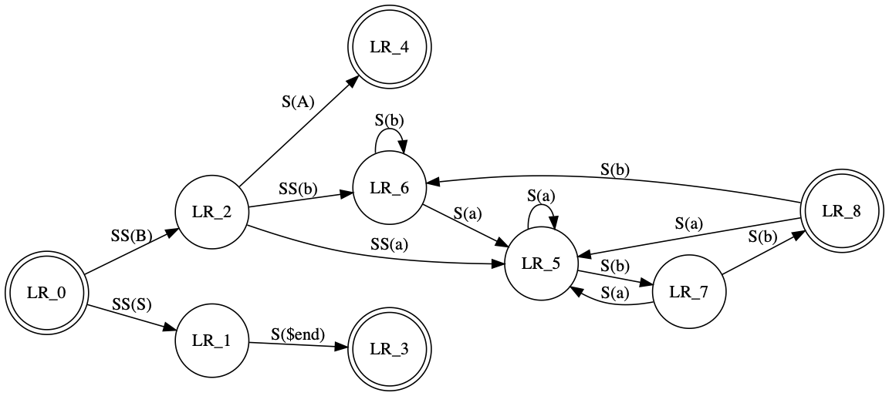

# Outline

This is where I start

## Simple Code

The following is a simple command:

```c
#include <stdio.h>
#include <stdlib.h>

int fib(int n) {
  return n < 3 ? 1 : fib(n-1) + fib(n-2);
}

int main(int argc, char** argv) {
  int n = atoi(argv[1]);11
  printf("fibonacci of %d is %d\n", n, fib(n));
}
```
```error
omd.cc:9:27: error: expected ';' after expression
  int n = atoi(argv[1]);11
                          ^
                          ;
omd.cc:9:25: warning: expression result unused [-Wunused-value]
  int n = atoi(argv[1]);11
                        ^~
1 warning and 1 error generated.
```

This code is pretty straight forward - but what does it communicate?


