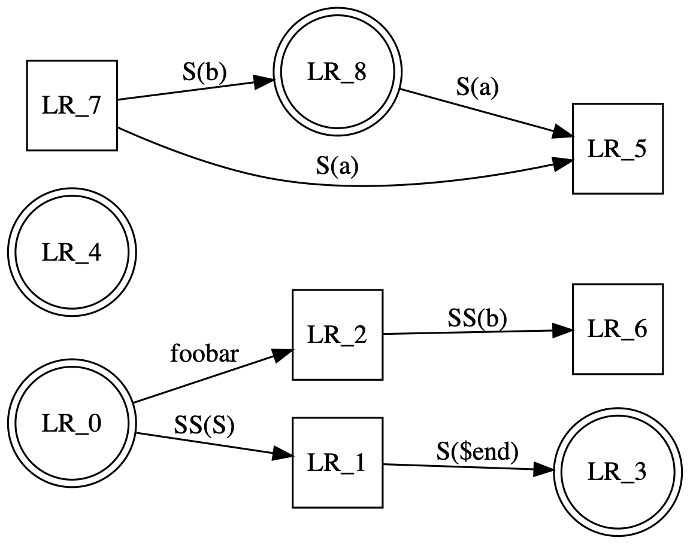

<!--TOC-->

# Outline

This is where I start

## Simple Code

The following is a simple command:


```cc
int fib(int n) {
  return n < 3 ? 1 : fib(n-1) + fib(n-2);
}

int main(int argc, char** argv) {
  int n = atoi(argv[1]);
  printf("Fibonacci number of %d is %d\n", n, fib(n));
}
```
```
Fibonacci number of 10 is 55
```

This code is pretty straight forward - but what does it communicate?

Now some ruby:

```ruby
require 'benchmark'

data = "1" * 1000
n = 1000
Benchmark.bm do |x|
  x.report("+=") { s = ""; for i in 1..n; s += data; end }
  x.report("<<") { s = ""; for i in 1..n; s << data; end }
end
```
```ruby
       user     system      total        real
+=  0.117288   0.097441   0.214729 (  0.215222)
<<  0.000552   0.000406   0.000958 (  0.000957)
```

and some SQL:

```sql
SELECT *
FROM
  generate_series(1, 4) as a(aa),
  generate_series(1, 2) as b(b)
```
|aa | b|
|---|--|
|1 | 1|
|1 | 2|
|2 | 1|
|2 | 2|
|3 | 1|
|3 | 2|
|4 | 1|
|4 | 2|
|(8 rows)|


